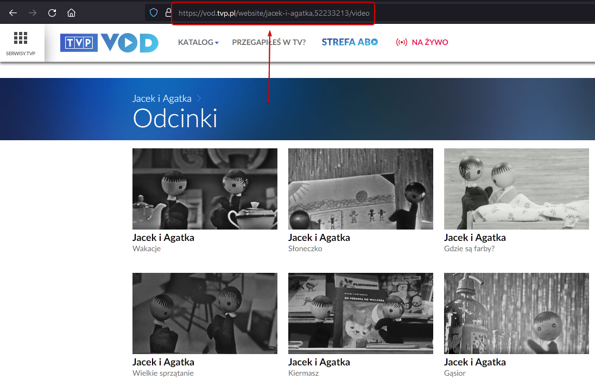

# **TODO: npm/moduły/instalacja!**

# vod.TVP.pl downloader

Niewielki program pozwalający pobrać na dysk wszystkie, bądź tylko wybrane pozycje z oferty serwisu vod.tvp.pl.

## Serwis streamingowy [vod.tvp.pl](https://vod.tvp.pl/)

Za wiki: ***TVP VOD*** – *polski serwis VOD należący do Telewizji Polskiej, uruchomiony w 2010 roku jako podstrona tvp.pl, na której były umieszczane produkcje TVP.*
*(...) Platforma umożliwia odtwarzanie programów własnych TVP oraz licencjonowanych produkcji innych nadawców tj. BBC(...)*

## :bulb: Uruchamianie :bulb:

### Adres danego programu

Jeżeli chcemy ściągnąć interesujący nas program lub odcinki, musimy najpierw wyszukać daną pozycję w serwisie vod.tvp.pl. W tym celu przechodzimy na stronę platformy oraz przechodzimy do sekcji ***Odcinki*** danego programu. Powinna ukazać się lista wszystkich dostępnych odcinków danej produkcji (*patrz: gif wyżej*).

Ostateczny adres kopiujemy w tym miejscu z paska adresu:

### Argumenty oraz wywołanie programu

Program uruchamiamy poprzez wywołanie aplikacji tvpdown.js z odpowiednimi argumentami. **Jedynymi wymaganymi** argumentami jest *adres do odcinków* ze strony vod.tvp.pl oraz *folder docelowy*, do którego zostaną pobrane pliki. W przypadku gdy folder nie istnieje, zostanie on utworzony.

Kolejne argumenty (już **nieobligatoryjne**) to odpowiednio wybrany przez nas bitrate (póki co jedynie minimalny/maksymalny (odpowiednio **min** oraz **max**)), numer **odcinka od którego chcemy rozpocząć pobieranie** oraz kolejno numer **odcinka na którym chcemy zakończyć pobieranie**. Program sortuje odcinki według kolejności ich występowania na platformie.
Jeżeli nie zostanie podany bitrate (min/max) lub numery odcinków - zostaną pobrane **wszystkie pliki** w minimalnym dostępnym aktualnie bitrate.
Ostatni argument możemy też pominąć jeżeli podamy numer początkowego odcinka - *pobrane zostaną wszystkie odcinki od podanego numeru do ostatniego odcinka* dodanego na platformę vod.tvp.pl.

### Przykład pobierania odcinków serialu *„Jacek i Agatka”*

Poniżej znajduje się przykład uruchomienia programu w celu pobrania dwóch pierwszych odcinków serialu dla dzieci *„Jacek i Agatka”*. Do katalogu ***jacek-i-agatka*** zostaną pobrane dwa pierwsze odcinki w minimalnym dostępnym aktualnie bitrate:

Efektem działań jest utworzony katalog ***jacek-i-agatka*** zawierający dwa w pełni działające oraz odtwarzające się odcinki serialu:

-------------------------------------------------------------------------------------------------